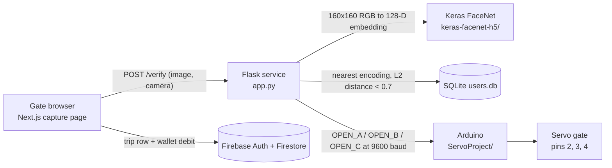

# face-gate-transit

A face-recognition fare gate for a transit network. A passenger enrols once with a photo of their face; at each gate a browser captures a frame and posts it to a Flask service, which embeds the face with a pretrained Keras FaceNet model and matches it against the enrolled encodings. On a match the service drives a servo gate through an Arduino over a serial link, and the web app opens or closes a trip in Firestore and debits the fare for that entry/exit gate pair from the passenger's wallet. The repository holds all three parts: the Next.js web app (`frontend/`), the Flask recognition service (`app.py`), and the Arduino sketch (`ServoProject/`).

## Architecture



**Enrolment** — the signup page posts the passenger's email and a captured or uploaded photo to `POST /signup`. The service saves the image to a temporary file, computes an L2-normalised 128-dimension embedding, stores it as a comma-separated string in the `users` table of `users.db`, and deletes the file. On success the client creates the Firebase Auth account and a Firestore `Users/{email}` document seeded with `wallet: 5000`.

**Recognition** — the home page posts a webcam frame plus the selected gate to `POST /verify`. The service embeds the frame, takes the nearest enrolled encoding by Euclidean distance, and returns `{"message": "Not recognized"}` when the best distance exceeds `0.7`. Otherwise it writes `OPEN_A`, `OPEN_B` or `OPEN_C` to the Arduino serial port and returns the matched username.

**Trip and fare** — fare accounting runs in the client against Firestore. The first recognised scan opens a `Data` row holding `{email, timestamp, start}`. The next scan closes that row with `{end, fare}`, where the fare is the amount configured for the sorted gate pair (`A_B`, `A_C`, `B_C`), then subtracts it from `Users/{email}.wallet` and warns the passenger when the remaining balance falls below 10. The dashboard reads back the wallet balance and the passenger's trip history.

## Stack

- **Frontend** — Next.js 14 (App Router, `output: 'export'`), React 18, Chakra UI, `react-webcam`, axios, moment
- **Identity and records** — Firebase Auth (email/password) and Cloud Firestore (`Users`, `Data`)
- **Backend** — Python, Flask + Flask-CORS, TensorFlow/Keras 2.11, NumPy, pyserial
- **Model** — Keras FaceNet (`inception_resnet_v1`, 160x160x3 input, 128-D bottleneck), loaded from `keras-facenet-h5/model.json` + `model.h5`
- **Encoding store** — SQLite (`users.db`, created on first run)
- **Hardware** — Arduino with three hobby servos on the `Servo` library

## Repository layout

```
app.py                     Flask service: /signup, /verify, SQLite store, serial writes
requirements.txt           Backend pins (TensorFlow 2.11.0, NumPy 1.21.6, Flask 2.2.5, pyserial)
keras-facenet-h5/          FaceNet architecture (model.json) and weights (model.h5, not in git)
FaceReco.ipynb             Notebook the recognition logic was derived from (course assignment)
fr_utils.py                Course assignment helper module (vendored)
inception_blocks_v2.py     Course assignment model builder (vendored, unused by app.py)
ServoProject/Project/      Arduino sketch: Project.ino, ServoControl.{h,cpp}
frontend/
  src/app/page.js          Gate page: camera select, capture, verify, trip and fare writes
  src/app/signup/page.jsx  Enrolment: photo + account creation
  src/app/login/page.jsx   Email/password login
  src/app/dashboard/page.jsx  Wallet balance and trip history
  src/components/          Wallet card, loading indicator
  src/config/firebase.js   Firebase web app config (public client config)
  .env                     Fare table and backend URL placeholders
```

## Running it

### 1. Model weights

`app.py` loads `keras-facenet-h5/model.json` and `keras-facenet-h5/model.h5` from the repository root. The architecture JSON is checked in; the 88 MB weights file is not. Obtain `model.h5` from the `keras-facenet-h5/` folder of the deeplearning.ai *Deep Learning Specialization*, Course 4 (Convolutional Neural Networks), Week 4 "Face Recognition" programming assignment, or from an equivalent Keras port of FaceNet whose layers match `model.json` (`inception_resnet_v1` with a 160x160x3 input and a `Bottleneck` 128-unit output). Place it at `keras-facenet-h5/model.h5`.

### 2. Backend

```bash
python -m venv .venv && source .venv/bin/activate
pip install -r requirements.txt
```

`requirements.txt` pins TensorFlow 2.11.0 and NumPy 1.21.6, so use a Python version those wheels support (3.10 or older).

Set `ARDUINO_PORT` at the top of `app.py` to the serial port of the board (`COM3` on Windows, something like `/dev/ttyACM0` or `/dev/tty.usbmodem*` elsewhere), then:

```bash
python app.py
```

The Flask development server listens on `http://127.0.0.1:5000` with CORS open. `app.py` opens the serial port at import time, so the Arduino must be connected before the service starts.

### 3. Frontend

```bash
cd frontend
npm install
npm run dev
```

Fill in `frontend/.env` before starting — the file ships with placeholders:

```
NEXT_PUBLIC_CAMERA_A_B_FARE=10
NEXT_PUBLIC_CAMERA_A_C_FARE=20
NEXT_PUBLIC_CAMERA_B_C_FARE=15
NEXT_PUBLIC_BACKEND_URL=http://127.0.0.1:5000
```

`frontend/src/config/firebase.js` holds the Firebase web app config; point it at a project with Email/Password sign-in and Firestore enabled. The build is a static export, so `npm run build` writes a self-contained site to `frontend/out/`, which can be served with `npx serve@latest out`.

Gates are labelled from the browser's camera list: `navigator.mediaDevices.enumerateDevices()` is filtered to video inputs and the results are labelled `A`, `B`, `C`, in order, so the machine driving the gates needs the cameras attached in a stable order.

## Hardware

`ServoProject/Project/Project.ino` is an Arduino sketch built on the standard `Servo` library. Open the `ServoProject/Project` folder in the Arduino IDE and upload it; `ServoControl.cpp` and `ServoControl.h` compile alongside the sketch.

- Three servos attach to digital pins 2, 3 and 4 (gates A, B and C respectively), set in `setupMotors(2, 3, 4)`.
- The sketch reads newline-terminated commands on the serial port at 9600 baud and matches `OPEN_A`, `OPEN_B` and `OPEN_C`.
- Opening sweeps the servo from 0 to 90 degrees in 5-degree steps, holds for 5 seconds, then sweeps back. The sweep blocks the loop, so commands arriving during a gate cycle are queued in the serial buffer.

## Status

Built between June and December 2024 as a personal project, and unchanged since.

Known gaps to be aware of before running it:

- The gate selector stores `MediaDeviceInfo.deviceId` values, while `app.py` and the fare table expect the labels `A`, `B` and `C`.
- `FaceReco.ipynb` reads `images/andrew.jpg`, `images/kian.jpg` and `images/camera_0.jpg`; that folder is not in the repository.
- Fare debits are computed and written by the client, and the Flask service has no authentication of its own.

## Attribution

The face-recognition core is not original work. `fr_utils.py`, `inception_blocks_v2.py` and the model-loading, `triplet_loss`, `verify` and `who_is_it` functions in `FaceReco.ipynb` are taken from the deeplearning.ai *Deep Learning Specialization*, Course 4 (Convolutional Neural Networks), Week 4 "Face Recognition" programming assignment, and are used here essentially verbatim; `app.py` reuses that assignment's `img_to_encoding` and distance-threshold logic. `fr_utils.py` in turn carries an upstream credit to Victor Sy Wang's [Keras-OpenFace](https://github.com/iwantooxxoox/Keras-OpenFace), and those helpers were written against OpenFace's `nn4.small2.v7` model, which the running system does not use. The pretrained weights in `keras-facenet-h5/` are a Keras port of FaceNet distributed with the same assignment. The method itself is Schroff, Kalenichenko and Philbin, [FaceNet: A Unified Embedding for Face Recognition and Clustering](https://arxiv.org/abs/1503.03832) (2015). The Next.js frontend was originally written by [Ubaid Ur Rehman](https://github.com/ubaid1840); the Flask service, the Arduino gate, the notebook and the later changes to the gate page are mine.
